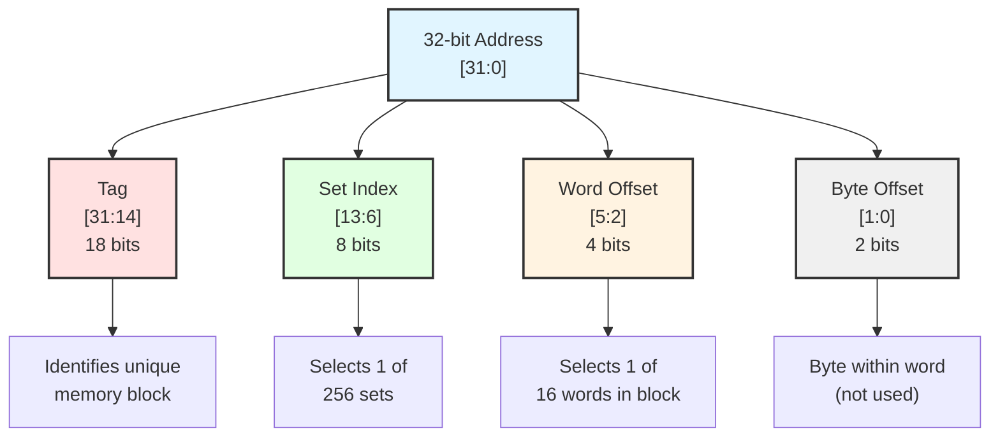
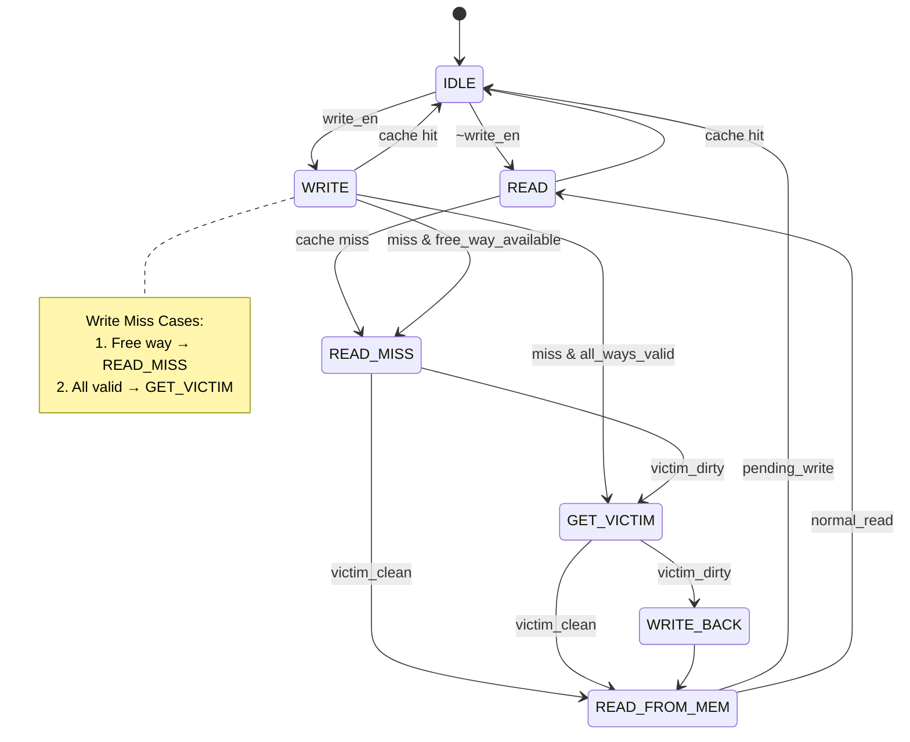

# 4-Way Set Associative Cache (Using LRU Policy)
A fully functional 4 way set associative cache implemented in system verilog and tested using icarus.

## Overview
This project features a 4 way set associative cache which uses LRU Policy for write-backs.
**Project status:** Completed and Verified.
**Development Time:** October - November 2024  
**Language:** SystemVerilog  

## Key features:
- **4-Way Set-Associative Architecture**
  - 256 sets with 4 ways per set
  - 16-word (64-byte) cache blocks
  - Total cache size: 32 KB

- **LRU Replacement Policy**
  - LRU implementation using counters
  - Efficient victim selection on cache misses
  - First-free replacement on write misses (Prefering free blocks over LRU count)

- **Write-Back Policy**
  - Dirty bit tracking per cache line
  - Write-back on eviction only
  - Reduced memory traffic

- **Write-Allocate Strategy**
  - Fetch block on write miss
  - Consistent with write-back policy
  - Improved spatial locality exploitation

  - **Comprehensive FSM Control**
  - 7-state finite state machine
  - Handles hits, misses, and evictions
  - Clean state transitions

### Cache Organization:

Total Size:    32 KB
Block Size:    64 bytes (16 words)
Associativity: 4-way
Number of Sets: 256
Address Width: 32 bits [31 : 0]
Data Width:    32 bits [31 : 0]

### Address Breakdown
No. of sets = 256, hence 8 bits required to uniquely express each set (2^8 = 256)
No. of words = 16 since 2^4 = 16 
Remaining MSBs are used for tag matching. 



(Last 2 bits used as BYTE OFFSET)

## 🔄 FSM State Machine

The cache controller uses a 7-state finite state machine to manage cache operations:



### State Descriptions

| State | Description | Duration |
|-------|-------------|----------|
| **IDLE** | Waiting for read or write request | 1 cycle |
| **READ** | Tag comparison and hit detection for reads | 1 cycle (hit) |
| **WRITE** | Tag comparison and hit detection for writes | 1 cycle (hit) |
| **READ_MISS** | Determine if victim writeback needed | 1 cycle |
| **GET_VICTIM** | Select LRU way for replacement | 1 cycle |
| **WRITE_BACK** | Write dirty victim block to main memory | ~7 cycles |
| **READ_FROM_MEM** | Fetch new block from main memory | ~6 cycles |

### State Transitions & Performance

**Read Hit:** `IDLE → READ → IDLE` (2 cycles)
- Fast path: Tag compare and data output

**Read Miss (clean victim):** `IDLE → READ → READ_MISS → READ_FROM_MEM → READ → IDLE` (~6 cycles)
- Fetch new block from memory, no writeback needed

**Read Miss (dirty victim):** `IDLE → READ → READ_MISS → GET_VICTIM → WRITE_BACK → READ_FROM_MEM → READ → IDLE` (~7 cycles)
- Writeback dirty victim, then fetch new block

**Write Hit:** `IDLE → WRITE → IDLE` (2 cycles)
- Update cache line, mark dirty

**Write Miss - Case 1 (free way available):** `IDLE → WRITE → READ_MISS → READ_FROM_MEM → IDLE` (~5 cycles)
- At least one invalid way exists
- Fetch block and write to free way
- No victim selection or writeback needed

**Write Miss - Case 2 (all ways valid, dirty victim):** `IDLE → WRITE → GET_VICTIM → WRITE_BACK → READ_FROM_MEM → IDLE` (~7 cycles)
- All ways valid, use LRU replacement
- Selected victim is dirty (dirty bit = 1)
- Writeback victim, then fetch new block

> **Note:** Cycle counts assume single-cycle memory access in simulation. In real hardware with DRAM, the miss penalty would be significantly higher.

### Control Signals

The FSM generates the following control signals:

- `read_true` - Asserted in READ state on cache hit
- `write_hit_true` - Asserted in WRITE state on cache hit  
- `write_back_true` - Asserted in WRITE_BACK state
- `read_from_main_mem_true` - Asserted in READ_FROM_MEM state

These signals control the cache datapath operations for each transaction.


## Verification & Results

### Test Coverage

The testbench includes 11 comprehensive test scenarios:

1. **Cold Start Read Miss** - Initial cache population
2. **Read Hit** - Same location access
3. **Different Offset Hit** - Within same block
4. **Fill All Ways** - Complete set population
5. **LRU Verification** - Replacement policy testing
6. **Write Hit** - Write-back behavior
7. **Write Miss** - Write-allocate policy
8. **Multiple Sets** - Set isolation verification
9. **Multi-Way Access** - Associativity testing
10.**Full Block Read** - All offsets in block
11.**Multi-Offset Write** - Multiple writes to same block


## Key Implementations

### LRU Replacement 

>replaces the least recently used block

function automatic integer get_replacement;
input [SET_WIDTH - 1 : 0] set_index;
    begin
    integer max;
    integer victim;
        max    = -1;
        victim = 0;

        for (integer i = 0; i < WAY; i++) begin
            if (LRU_COUNTER[set_index][i] > max) begin
                max    = LRU_COUNTER[set_index][i];
                victim = i;
            end
        end
        return victim;
    end
endfunction

### Free-Way selection

>override LRU when a write miss occurs and a free block/way is availabe

function automatic integer free_way;
input[SET_WIDTH - 1 : 0] set_index;
    begin
        for (integer i = 0; i < WAY; i++) begin
            if(VALID[set_index][i] == 1'b0) begin
                return i;
            end
        end
    end
endfunction

### Latch onto the address and data received (write)

>save the address and received that so that write backs and other multicycle operations can be performed 

latched_set    <= set;
latched_tag    <= tag;
latched_offset <= offset;
latched_data_in <= data_in;


### Critical Path Analysis

The critical path in the design is:
1. Tag comparison (parallel across 4 ways)
2. Hit detection (OR of 4 comparisons)
3. Way selection multiplexing
4. Data output

## Debugging Journey

### Challenge 1: Single-Cycle to Multi-Cycle Redesign

**Problem:** Initially designed the cache as a single-cycle memory system, which didn't properly model real cache behavior.

**Root Cause:** Misunderstanding of cache timing - hits and misses have different latencies.

**Solution:** Complete FSM redesign with 7 states to handle multi-cycle operations (hits, misses, writebacks).

**Learning:** Cache operations aren't uniform - FSMs are essential for managing different access patterns.


### Challenge 2: LRU Counter Updates for Invalid Blocks

**Problem:** LRU counters were being updated even for invalid ways, causing two ways to have the same LRU value after repeated accesses to one block.

**Root Cause:** LRU update logic didn't check validity before incrementing counters.

**Solution:** Modified update logic to only affect valid ways. The LRU selection function already prioritized valid blocks, so this fixed the counter divergence.

**Impact:** While the original bug didn't break functionality (victim selection was still correct), the fix ensures cleaner state representation and easier debugging.
```systemverilog
// Fixed LRU update
LRU_COUNTER[latched_set][i]       <= 0;
for (integer j = 0; j < WAY; j++) begin
    if(j != i && VALID[latched_set][j]) begin
        LRU_COUNTER[latched_set][j] <= LRU_COUNTER[latched_set][j] + 1;
    end
end
```
**Learning:** Edge cases with partially-filled caches require careful attention to validity bits.


### Challenge 3: Address Latching Timing

**Problem:** Not latching address and data early enough caused timing synchronization issues - operations were using stale or incorrect addresses.

**Root Cause:** Address was being captured in the wrong FSM state, causing offset and data misalignment.

**Solution:** Latch address and write data in IDLE state before transitioning to READ/WRITE states:
```systemverilog
IDLE: begin
    if (read_en || write_en) begin
        latched_set    <= set;
        latched_tag    <= tag;
        latched_offset <= offset;
        latched_data_in <= data_in;  // For writes
    end
end
```
**Learning:** In multi-cycle FSMs, signal latching timing is critical. Capture inputs at state entry, not during state execution.


### Challenge 4: Memory Initialization

**Problem:** Main memory returned `'x'` (undefined) values on reads.

**Root Cause:** Memory array wasn't properly initialized in simulation.

**Solution:** Added initialization block:
```systemverilog
initial begin
    for (int i = 0; i < MEM_SIZE; i++) begin
        main_memory[i] = (i << 16) | i;  // Pattern for testing
    end
end
```

**Learning:** Always initialize memories in simulation, even if synthesis handles it differently.


### Challenge 5: Writeback Address Calculation

**Problem:** Dirty victim blocks were being written back to incorrect memory addresses.

**Root Cause:** Wasn't properly reconstructing full address from victim's tag and set index.

**Solution:** Correct address reconstruction:
```systemverilog
 victim_addr = {victim_tag, latched_set};
```
**Learning:** Address composition/decomposition must be consistent throughout the design.


**Debugging Methodology:**
1. **Isolate**: Test each component independently
2. **Assertions**: Add checks for impossible states
3. **Incremental**: Fix one bug at a time, verify, then move on


## What I Learned

### Technical Skills

- **FSM Design:** Importance of proper state transitions and timing
- **Memory Hierarchies:** Trade-offs between associativity, size, and complexity
- **Replacement Policies:** LRU implementation and hardware costs
- **Write Policies:** Write-back vs write-through trade-offs
- **Timing Analysis:** Critical importance of signal latching timing

### Best Practices

- **Incremental Testing:** Test each component before integration
- **Documentation:** Clear comments and diagrams save debugging time
- **Parameterization:** Configurable designs are more flexible and reusable


## Future implementation

- **Psuedo LRU Behaviour:** To reduce hardware complexity for synthesis
- **Performing other operations while handling misses:** Perform reads and writes for other addresses while handling previous misses
- **Performance Counters**: Add hit/miss rate monitoring 
- **Multi-Level Cache**: Add L2 cache support
- **Integration with a RISC-V CPU**

##  Author

**[Om Gupta]**
- GitHub: [@Omie2806](https://github.com/Omie2806)
- Email: omgupta2806@gmail.com

*2nd Year Electronics Engineering student*  
*VJTI Mumbai*


## Acknowledgments

- Thanks to the open-source hardware community
- Inspired by Digital System design by Harris and Harris
- Digital System design NPTEL course 
- Claude AI for testbenches and help with debugging
